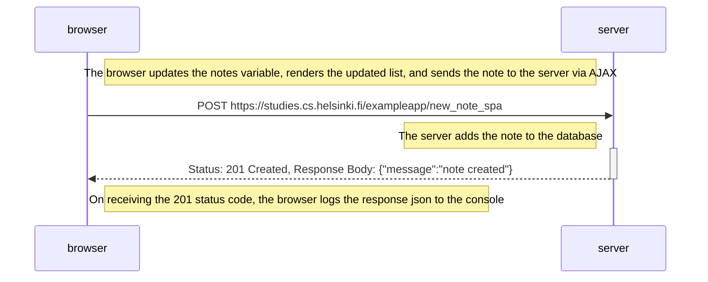

```mermaid
sequenceDiagram
    participant browser
    participant server

    Note right of browser: The browser updates the notes variable, renders the updated list, and sends the note to the server via AJAX
    browser->>server: POST https://studies.cs.helsinki.fi/exampleapp/new_note_spa
    Note left of server: The server adds the note to the database
    activate server
    server-->>browser: Status: 201 Created, Response Body: {"message":"note created"}
    deactivate server
    Note right of browser: On receiving the 201 status code, the browser logs the response json to the console
```

